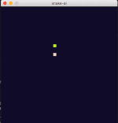

# snake-ai
Snake agent using Q-learning

## States
The snake has an 4 binary states showing wheter or not the positions surrounding the snakes head is occupied and one state indicating in what direction the apple is located. 

## Reward
The snake is gets a reward of +1 if it moves closer to the apple and a -1 if it moves further away. Additionaly it gets +300 if it consumes an apple. Lastly it gets a reward of -1000 if it either crashes into it self or into the walls

## Training 
The snake trained for a total number of 20000 episodes. Every 1000:th episode the value of the learning rate and the discount was decreased by a factor of 0.9. To train the network simply run train.py, and change the paramters as seen fit

## Performance
During the evaluation the trained snake was allowed to run for a total of 1000 episodes. It produced a maximum and an average length shown in the table below

| Q-table | Average Length | Maximum Length | Size  |
|---------|:--------------:|:--------------:|-------|
|    1    |     11.449     |       49       | 40x40 |
